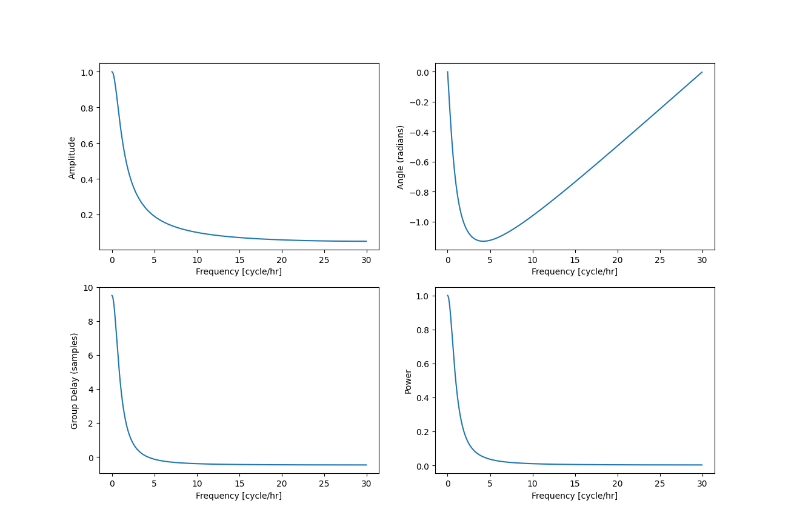
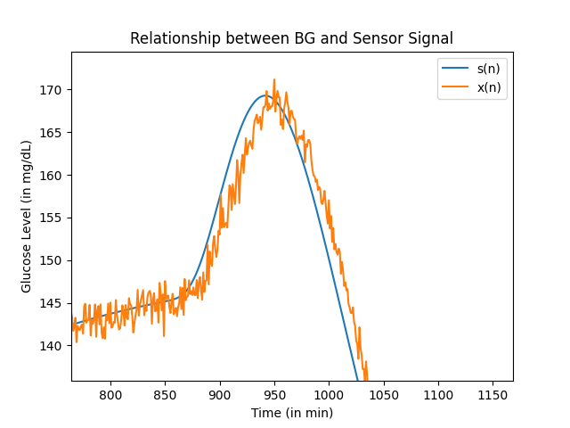
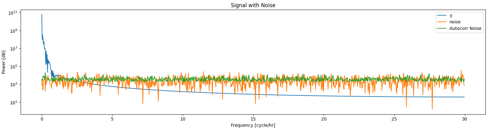
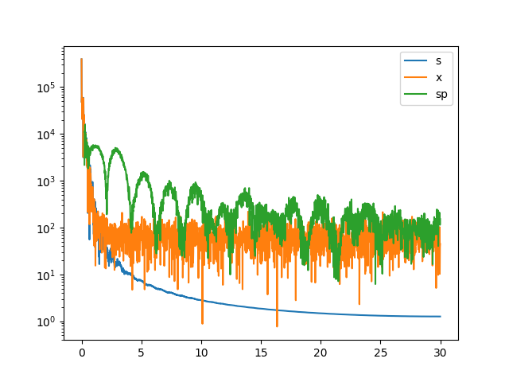

# CGM-Weiner-Filter
This repository is meant to house the implementation of "Interstitial fluid glucose time-lag correction for real-time continuous glucose monitoring" by Keenan et al.

The purpose of this repository is to explore the domain of glucose monitoring and to review the interesting concept of the Weiner filter from signal processing theory.

## Signal Generation

In the paper, the authors how the process of glucose monitoring can be represented as a simple model as seen below:

This model is essentially a differential equation where glucose shifts according to concentrations in the 3 compartments: capillary, interstitial fluid (ISF), and fat/muscle. The capillary compartment is important because that's what we're interested in finding the blood glucose (BG) level of, and the ISF compartment is important because that's where the measuring by the sensor occurs; the fat/muscle compartment is not as important and only matters for the clearing of the ISF. 

This physio model can be represented as a signal processing diagram below 

In this diagram, s(n) is the BG of the capillary compartment, H(z) is a filter representing the barrier between capillary and ISF, y(n) is the BG of the ISF compartment, e(n) is electronic noise from the sensor/hardware, x(n) is the digitized signal, G(z) is the Wiener filter, and s'(n) is the estimate for the capillary BG. 

In order to create the capillary BG signal, I relied on a simulator called simglucose that generates somewhat realistic BG signals with customizability without the need for the actual data, which may be hard to come by. 

Once the BG signal is created, the next step is to pass it through the diffusion filter. The authors outline that they used the following: 

The diffusion filter was derived from a differential equation modeling the change in the ISF's total glucose over time. While I will not go through the entire derivation, however the differential equation is here:

The diffusion filter values are characterized by a time lag (tau) of 10 minutes, a 1-minute sample interval, and a unity gain.

What is a unity gain? Well, in this model the sensor signal (x(n)) is a scalar ($\alpha$) multiple of y(n), and y(n) is scalar ($\Kappa$) multiple of capillary BG (s(n)). Together, these scalar multiples create a non-unity gain between s(n) and x(n) and must be corrected using a calibration factor (1/($\alpha\Kappa$)) to make it a unity gain. This calibration factor is often calculated using finger sticks to get s(n) in order to calibrate x(n). By using the H(z) from above, we're essentially assuming the sensor we're using is already calibrated.  

Once the diffusion filter is applied, the delay of between s(n) and y(n) should be about 10 minutes. This was confirmed visually from plotting both together.

Additionally, the authors included a magnitude frequency response and group delay for H(z). Below is magnitude and phase plots as well as power and group delay. The 2 on the left look like the ones in the article to better confirm that this filter was implemented properly.

The next step is to add noise to y(n) to get x(n). 

The article states that it added additive white Gaussian noise (AWGN) to the signal to mimic typical electronic noise, digitization, and hardware filtering seen in enzymatic sensors. The article states that the signal to noise ratio (SNR) is 40 dB.

Below you can see the Power Spectrum Density (PSD) of Y and noise that gives a SNR of 40dB. You can see that as the frequency increases, the noise level starts to obscure the signal. This is a classic example of when to apply the Weiner filter. 

Adding the noise to y(n) gives x(n), and below are the PSDs. Notice how the output signal has the noise floor now. 

In order to determine a measure of the noise x(n), we must utilize knowledge of the creation of x(n). We know the noise level relative to the signal since we created the signal. From there we can get an absolute measure of noise to compare across signals. We must retrace our steps through the plotting we just did. 

The instantaneous power of a signal, x(t), is $x^2(t)$. The total power of a signal is the integral of the instantaneous power $P_{tot} = \sum_{-\infty}^\infty \lvert x(t) \rvert ^2 dx$. Then average power is the average of the total power, which is $P_{signal} = P_{tot} / N$. 

The power spectrum density describes the distribution of power over various frequencies. The energy spectrum density is the same thing but integrated over a finite time interval. Since there is nothing as an infinite time interval, in practice anything we call a PSD is actually us measuring an ESD of a signal and assume the signal is periodic. So the ESD is ${S}_{xx}(f) = \left| \hat{x}(f) \right|^2$. Assuming the signal we are applying to is periodic, which is a valid assumption, we can call this the PSD, too. 

Parseval's theorem states: 

$\int_{-\infty}^\infty |x(t)|^2\, dt = \int_{-\infty}^\infty \left|\hat{x}(f)\right|^2\ df$

This means that the total power of a signal can be found over time or frequencies. The integral over all frequencies is the expected total power of the signal. So the average power can be found either using the time or frequency domains.

The average power is the quantity involved in the SNR calculation, which is $SNR = \frac{P_{signal}}{P_{noise}}$, or $SNR_{dB} = P_{signal,dB} - P_{noise,dB}$ or $SNR_{dB} = 10\log{P_{signal}/P_{noise}}$. Since it's a ratio, one could replace average power with total power. 

So in the calculation of the generated noise, I squared the y(n), as is, and found the average to give the average power of the signal. Then use the formula $P_{dB} = 10log(P)$ to convert the average power to dB. So $P_{noise,dB} = P_{signal,dB} - SNR_{dB}$. This is how I came up with the noise signal. While it is good to be able to create a noise signal and apply it, in order to properly understand the Wiener filter we must fully understand the noise.

So to theoretically get $P_{noise,dB}$ from a mixed signal $P_{signal,dB} + P_{noise,dB} = P_{total,dB}$. $P_{total,dB}$ is easy to calculate, using the technique above. It then follows that the noise level should theoretically be calculable at the higher frequencies when the signal power dips below the noise power, then the $P_{signal}$ can easily be found based on that. Below is x(n), the resulting delayed signal with noise. 

Next, it is important to determine what qualifies as "higher frequency". From the noise calculation, we know that the average noise power here is 1.7706 (mg/dL)^2, which is 2.4813 dB.

Some things to note before going deeper. For white noise, the average noise power is equal to noise variance, which I utilize when creating the noise signal. The integral of the PSD is the variance. In a true white noise scenario, the integral of the PSD is infinite and therefore the variance is infinite. In our case, we can only see the lower frequencies, so we're unable to completely calculate the integral and therefore cannot get the variance from the PSD. Additionally, 2 signals could have the same variance but completely different PSDs, so if we have the variance, which we can calculate from the time domain signal, then we can't necessarily get the PSD from that. 

In order to get the PSD, we need to take the Fourier Transform of the Autocorrelation of the noise. This will give us the PSD of a process. This is plotted below.

You can see that the autocorrelation-derived noise PSD is at around the same level as the noise magnitude PSD, except more stable. So this shows that the noise PSD can be found either way. This is confirmed by taking the average of each spectra. 

So either way, one can find the noise level by taking either or. The intersection of the average noise level and the signal level is at a little under 2 cycle/hr, so any Wiener filter related things will probably involve that and then after this point would be a probable place to gauge the level of noise. 

It then follows that one must determine if it is as easy as averaging the spectrum at higher frequencies.

I averaged 5 means of each noise PSD approach and then averaged 5 means of each noise PSD approach only using the last 50% of the displayed spectrum. They were basically the same as the full spectra. The main difference it would seem is that the autocorrelation method is ~300 (or 9%) higher than the standard FFT, which isn't a huge deal it seems based on plotting. This and the fact that the autocorrelation method has less variance in the spectrum are the 2 big factors. Doing the same with the fully mixed signal yields the same average so it is a viable technique.

However, glucose signals contain a baseline drift over the course of days. By definition, the Fourier Transform used to get the PSD operates under the assumption of periodicity, which doesn't include signals that contain a perpetual baseline drift. A Fourier Transform of such a signal will contain an inflated level of lower frequency content due to this baseline drift. Thus, in order to combat this by breaking a multi-day signal into separate days and then applying the Fourier Transform to each day under a safer assumption of zero-baseline drift. 

The "x Flat" spectrum is the spectrum up til this point, which is the spectrum of the cropped x. The "x" spectrum is the spectrum of the full signal that contains baseline drift. We can see that the baseline drift signal has higher content at the lower frequencies and then flattens out similar to the cropped signal. The higher content at lower frequencies makes sense as the baseline drift would add a significant amount of low-frequency energy.

The average of the upper frequencies is 4820 for the baseline drift signal and 3632 for the cropped signal (which is what we saw earlier). This suggests that the suggested noise feature is 1200 more (33% more) when it has the baseline drift. This could be a non-issue, but one must determine if it comes from the noise, the baseline drift signal, or a mix of both.

Plotting the noise spectrum, these noise spectrum look the same and their averages are 3387 for the cropped signal and 4167 for the full signal. This suggests that the noise is higher in the full signal, which is seemingly true, but is not that much higher. 

Plotting the pre-noise signal, y(t), and the cropped y(t), we can see that the PSD of the full is about 1000 and about 100, respectively. So the pre-noise signal about 1000 more than the PSD of the cropped at these higher frequencies. This could be due to the longer length of the full signal, or due to the baseline being introduced. I think it's more likely due to the full signal length, since the margin between the two are consistent (parallel) after 2 cycle/hour and that the spectrum is smooth and probably an artifact of a non-ideal signal. It could be an indirect consequence of the baseline drift. The signal contents are slightly higher just before the PSDs smooth out, and the smoothing out could still be an artifact of non-ideal signal.

So for the full signal, the x(t) is 4820, n(t) is 4167, and y(t) is 1000. For the cropped signal, the x(t) is 3632, n(t) is 3387, and y(t) is 100. Altogether, this seems as though the spectrums are additive (n + y = x). This is an example of the theory where the noisy signal power is the sum of signal power and noise power $P_{s+n} = P_{signal} + P_{noise}$, when the signal and noise are uncorrelated and zero-mean.

This experiment seems to confirm using the average of the upper frequencies isn't directly comparable between full and cropped signals. The y(t)'s are not the same levels and thus the noises aren't either, since they're tied together. The x(t)'s, being a sum of those, are also not comparable, but they do have the same SNRs. Since it's the same exact signal, the SNRs would be the same and any other noisier signals would have a higher SNR relative to this. This gives confidence that SNR is a good measure for comparison. So either way, one could compare SNRs among different signals and different length signals, but not necessarily the high frequency average powers. 

In theory, the characteristics of similar length segments of the same signal should be the same as long as there's no baseline drift. Such as, the noise should be the same and so should the signal power. However, when you incorporate baseline drift, this will change the signal power and thus the SNR over time assuming the noise characteristics are constant, which according to the article are a property of the hardware so this could be the case. More research is needed on that space, but for now the easy assumption is to say the noise stays constant and thus the SNR fluctuates with the baseline drift. This is also how the signal here is generated, that is: using the full signal to calculate power and thus noise from that as described above.

After researching a bit more, it seems as though SNR can also vary over time even with no baseline drift and instead in the form of variation in noise. Thus, to isolate these issues, it's necessary to use segments where there's no baseline drift and seemingly similar noise characteristics. The signal here has consistent noise characteristics so any SNR variations would be a result of baseline drift.

Earlier, we were able to calculate the SNR by finding the powers of the y(t) and n(t) using either integral over time or integral over frequency. The question is still how does one calculate the SNRs from x(t)?

It seems there are several ideas for this. 

(1) The simplest is:  $\mu^2/\sigma^2$, where the signal mean is divided by the signal variance. The pros are that it's used mainly with positive. The cons are that the mean and the variance would be heavily weighted towards the glucose signal. The variance could be found by taking the variance of a somewhat flat section of the signal whereas the mean could be found using the whole signal. This should be testable with the data of this work.

(2) Another way is to divide a sum of the amplitudes present in the signal-dominant part of the PSD, by that of the noise-dominant part. This would make sense as the integral of the PSD is the power. This approach is also doable since we know the components of a noisy signal.

According to the article, the fastest glucose digressions are 3 cycle/hr. Therefore, if we take the signal power (sum below +/-3 cycle/hr) and divide it by the noise power (sum above that threshold), $SNR_{dB} = 10\log{P_{signal}/P_{noise}}$ this should be a good estimate of SNR. 

This was confirmed by taking the sum of both the y(t)'s and n(t)'s PSDs and dividing them to get SNR, in this case 39.966 dB. Then as a more realistic approach, I tried taking the sections marked by +/-3 cyc/hr as discussed in the previous paragraph; this gave 40.355 dB. Lastly, I took the average of the upper frequencies and multiplied it by all bins to get noise content, then divide the <+/-3 cyc/hr sum by this. That would give a seemingly better estimate of the SNR, since $ (P_{x, <3} - P_{noise,<3})/(P_{noise,>3} + P_{noise,<3}) $. This would theoretically keep the power $P_{noise,<3}$ with the noise side of the equation instead of in the signal side. This one gave 40.058. But there is various fluctuation and each one is seemingly fine since they all hover over the known 40dB. The 1st option is impossible in practice, so I'll opt for the 2nd one since it's the simpler of the other 2. 

While theoretically, the signal content would be below +/-3 cyc/hr, in reality we may not be confident in this figure since the PSD wouldn't necessarily look like ours above. Other signals in the body may make the cutoff look higher or lower than 3. Thus, it would be safer to probably take the average of the higher noise, multiply it by the bandwidth to get the theoretical white noise power, subtract this from the total power to get the signal power since power is additive. Like so $P_{total} - P_{noise} = P_{signal}$, then divide signal power by noise power to get the SNR. In our case, this method gives a very very very similar answer to the previous method, so this is the best case. Lower risk but gives the same result.

So how do we prepare the data so that it gives the most accurate SNR? Earlier we said that baseline drift and signal noise changing over time can affect SNR. This is seen in real data. Thus, to minimize this, it is best to use a segment of the data that is relatively flat and has the same noise characteristics throughout. 

According to [3] (page 179), the baseline drift is "a non-physiological drift phenomenon related to a variation of sensor sensitivity after its insertion in the body when the sensor membrane enters in contact with the biological environment and undergoes the immune system reaction". It is often non-linear and also *this drift especially happens on the first day*, thus we wouldn't want to take just the first day. 

Taking the last day or two would result in less baseline drift, however this may be less ideal since the end of a signal is usually noisier than the beginning, making the SNR lower than the whole signal. Additionally, this may make the SNR metric suspectible to any large spikes at the end, which could occur in sensor removal.

To characterize a whole signal in a problem where the whole signal is being labeled, it would maybe be best to get the PSD of every day, average the PSDs, then find the SNR of the average PSD. 

The reasons for this are as follows:

1. Mitigate baseline drift effect
2. Doesn't throw away information
3. Doesn't bias any day/time of the signal (like noisy ends)
4. Completely automatic
5. Unarbitrary segmentation of the data (into days) utilizes the periodic nature of people making every segment comparable
6. Average PSD is closer to ideal PSD
7. Mitigates large spikes
8. Can break down average into day-by-day SNR to see noisy over time
9. SNR_dB is scale invariant, so signals of different scales are comparable

After experimenting a little, this measure seems to do a good job at defining noisiness and backs up what is seen visually.

In order to improve the metric to be the best it can be, it would be good to look into cropping the beginning and end of the signals, since those parts usually have large spikes due to application of the filter. Secondly, windowing could come into use here in order to reduce any effect of beginning/end circular discontinuities that would be seen after taking the FFT of a given day.

By segmenting a signal into days, essentially a rectangular window is being applied for each day. This is equivalent to convolution of the sinc function in the frequency domain. These sinc functions overlap at other frequencies to create overlapping leakage, which appears as signal content. 

Applying a non-rectangular window of some sort would widen the main lobe (reducing frequency resolution), lower the main lobe magnitude by around half and lower sidelobes significantly. In our case, this would probably reduce signal power by half since most of the signal power is below the 3 cyc/hr and then it would probably reduce the noise power even further, so theoretically the SNR would go up.

I think the best way to determine if this windowing method improves the noise metric would be to calculate it. 

Which window function to use though? The best would be one that is not rectangular, one that has equal side lobes (since the calculation assumes flat content from white noise).

Next question is how to apply it? Applying the window to each day would be problematic because the ends of each day (midnight to midnight) would contain sleep data and would suppress this information and bias day-time processes. This might be remedied by moving the center of the window along the signal, but I don't think so since it would introduce bias for night time, etc. 

I think the best way to apply windowing would be to apply it to each night and each day, separately. Create an SNR_dB for night and SNR_dB for day. That way, the windowing wouldn't bias night or day. Additionally, this approach would make sense as the two underlying processes that generate the two different signals are different, metabolically, and thus the signals are different and have different characteristics. Splitting the SNR_dB would be ideal, but it's difficult to segment the data this way. An easy way would be to use a fitness monitor to track sleep.

The other improvement mentioned is manual clipping of the signal to not include big spikes at the beginning and end of the signal. For spikes at the end, this part wouldn't affect SNR in the case of discarding incomplete segments. 

Another improvement that could be made is to use the last part and not discard any data. This would require mapping of the part-day segment to full-day segment, which would require mapping of a part-day PSD to full-day PSD. Possibly could include zero-padding. This turned out to be the case. If one has a part-day segment, then it can be zero-padded to be a full day. The resulting PSD shows the signal content of the part-day signal, but with the same number of points and the same frequency range as full-day segment PSDs. Thus, the PSDs can still be averaged into one and used that way. 

Now that we have considered, tested, and accepted the known improvements to the process of gauging the noise of a given signal, we can start to consider the measure for which they will be tuned. 

Now that we can confidently characterize noise in SNR_db we can now start building the Wiener filter that will filter the signal to hopefully give s(n). 

Calibration is usually used to compensate for the gradient and magnitude difference between the blood glucose and sensor signal, but doesn't account for the time delay. The Wiener filter tackles the time domain issue. The derivation of the Wiener filter comes from the following differential equation:

Once the signal is corrupted and delayed, the Wiener filter attempts to fix these problems by filtering as such:

Where g(k) are the p Wiener filter coefficients and s'(n) is the output. This is essentially a finite convolution of corrupted signal with the Wiener filter coefficients (which should be the impulse response). The optimal filter coefficients are $g_{opt}(k)$ and were calculated by having a set of ideal and measurement signals available, sampled every minute. From this 1-minute sampled signal, it was decimated to 20-minute samples to imitate measurement resolution of laboratory blood analyzers, this is the so-called "ideal" signal. The 1-minute signal is used as s(n) to create x(n). s(n) and x(n) are used to create the optimal filter coefficients.

Mean Square Error (MSE) criterion in least squares analysis can be conducted using the following formula: $g_{opt} = (Y^TY)^{-1}Y^Ts$ where the following matrices are defined as:

The number of columns equals one less than the order of the Wiener filter and the number of rows equals one less than the number of sensor values taken at 20 minute intervals. In the case of this study, a filter order of p=30 was best and the number of samples was N=4000. Thus, s is a  Y is a 3999x29 matrix. 4000 may actually be the number of samples in the 20 test sets. N is the number of samples in s(n) that is 20 minute intervals. Thus, each column of Y is the x(n) at that same time. 

Reading into the Wikipedia page, it seems that the Wiener filter is typically optimized using minimum mean-square error (MMSE) which requires the autocorrelation and cross-correlation, where X is auto-correlation of the input and Y is the cross-correlation between the output and input signals. This method is non-trivial.

It just so happens that for FIR Wiener Filters, the ordinary least mean squares filter happens to give the same result as the MMSE but doesn't rely cross-correlations or auto-correlations. I don't know why it does, there's probably a proof out there. 

The direct method of ordinary (linear) least squares should be very helpful in deciding what to do with our present equation. As brought up earlier, a filter order of 30 was used, meaning there's 31 coefficients (g(k) for k = 0...31). So I'm going to guess there are 31 columns. They give us the formula: 

 

s'(n) is the estimate given the x value (n). For a p=3 order filter: s'(n) = g(0) * x(n) + g(1) * x(n-1) + g(2) * x(n-2) + g(3) * x(n-3). x(n) is the signal at point n, thus could take any value. However, x(n) is the map from n to x, and s' is the map from x to s'. I think the top row will look something like: x(n) x(n-1) x(n-2) x(n-3); the article seems to have the exact same so this is a good sign. x(n) is a time series, so time now has to be considered. It's s(n)=..., so the dependent variable here isn't x, it's just n. x(n) is only just an intermediary function/process of the larger function, which is a convolution/filtering to reverse x(n), itself. The convolution considers p+1 consecutive points from x(n), which is essentially a 31-dimensional input.

The article states that each row has p-1 (probably meant p+1) sensor samples at 1 minute intervals. Under the recent understanding, this seems actually right. Now, for this Wiener filter problem, each row would be a single point in that 31-dimensional space. This single point would be 31-point series, as in the first row. So it seems that every row is a different series. According to the article, each row is taken at 20-minutes apart. So the difference between t0 and t1 is 20 minutes. Thus, for a 30 order filter, the 31 points in a row would contain some points from the next segment's series. I suppose the success of 30 might be due to a mathematical preference to partial overlap/interweaving of some sort. The s vector would then be the input value at the time corresponding to the row in the Y matrix.

In hindsight, the 30 order filter is 30-dimensional space. This is reinforced by the fact that all of the coefficients (orders) are multiplied by input points and there's no unitary input point or coefficient involved. Thus, 30 series need to be collected, each starting 20 minutes apart, 1 minute sample rate. The sensor values at each start time must be used too.

So the most recent take on things above is correct. It's important to note that x(n) in the summation above is the rightmost point in the train, x(n-1) is to the left of that and so forth. So you need to take that and then flip it to get the row for Y. The result is an estimate of g_opt, however when there's only 1 signal the magnitude response is noisy and appears wider than depicted in the article. The article seems to have an idealized version.

In order to achieve the idealized version, I tried to average the magnitude responses and group delays of different signals which removes noise in the spectra. I was only able to do 30, but it definitely improved as the number of signals got higher, definitely try more to see if this trend continues. Additionally, increasing the number of hours for each signal didn't seem to have much effect on the group delay, but did seem to widen the modal in the magnitude response and also the article says 40 hours, so increasing the number hours probably isn't the right direction. Potentially could make all of the signals from the same source so that there's consistency. 

This looks close but not exactly like Figure 7 in the article. The group delay is off by 10, although the magnitude response looks picture perfect. Also keep in mind that this is without noise in the signal. More work has to be done to get it to be the proper shape.

So I had realized that the numpy array I was storing was always set to be 50 rows, so I corrected that and also changed the Y array to contain y and x instead of s, which I don't know how that happened. Either way, the magnitude plot with the noiseless data has a very similar shape to the shape in the article, but the group delay starts not at -10 and also doesn't have a super similar shape if you consider the seemingly very noisy first little bit, but after that it seems to take somewhat of the shape; additionally the group delay curve is really smooth and changing the number of hours or number of rows doesn't seem to change the curve too much.

As for when noise is included, the group delay now always starts at -10 which is probably due to fixing the numpy array size issue from above paragraph. Interestingly, increasing the number of datasets/rows smooths out the magnitude response, as expected in the more general theory; although, the shape isn't as good as the noiseless data and is missing the initial rise. Even more interesting is that the length of each row dictates the smoothness of the first number of points in the group delay, but eventually the group delay gets too noisy. 

Everything is so close, but not perfect. I think the next step is to keep inching closer and see if the parameters can be tuned properly. I think independent group delays could look similar to the group delay graph in the article if it's a single group delay and not an average as I was doing. Below is a filter order of 64 (the highest recommended by the article), along with a frequency resolution of 1024. It's fairly smooth and has the same shape as the article. The average of these is poor and noisy probably due to the nonlinear wander.

The magnitude is the more reliable of the two. Below is the magnitude without noise (filter order 100), so if you consider that each individual group delay isn't too far off from the article and the average non-noise magnitude gets closer to the article with more signals, then I think the winner is more signals to determine the optimal coefficients. Everything else seems on point, from the building of the matrices, to the -10 start of the group delay, to the filter order being given by the article. So I'll continue to use 30 and apply it as such.

One thing I did not consider was that these average magnitude and group delay is that they don't directly mean that the mean coefficients can be applied. If you take just 1 signal, you get a very good magnitude (for y, without noise) and also a solid group delay. The reason the average group delay is not good is because those have random-like wander, whereas the magnitudes are pretty consistent so the average of those looks good too. In this revelation, I believe it is necessary to use just 1 because there is no obvious way to mix multiple Wiener filters without mean and mean clearly doesn't work.

Using just 1 actually gives really good time lag correction but doesn't seem to correct the noise. There's a paragraph about bandlimiting noise in the article, but I'm unsure what it means. The noiseless Wiener filter has a perfect magnitude a pretty good looking group delay but it may not start at -10. The noisy Wiener filter has a terrible magnitude but a better looking group delay. So it seems like the noiseless Wiener filter can take away the noise but the noisy Wiener filter somehow corrects the timelag. Applying the noiseless Wiener filter just blows up all the noise, probably somehow due to the fact that noise was not included in the Wiener filter calculation.

When looking at the magnitude response, the filtered signal not only has the time lag somewhat corrected, but also shows an amplification of the lower frequencies although not much suppression of higher frequency noise. Maybe the article knows this and that's why they mention bandlimiting the noise further. A linear magnitude response shows the amplification and seeming cut-off to noise suppression, around where the article suggests bandlimiting noise. There is scalloping in the magnitude response, so it might be worthwhile to look into reducing that; maybe increasing the filter order will help. It didn't appear to, although reducing it to 15 from 30 made the scalloping disappear a little and also I saw the initial rise and then drop down to more of noise reduction. Although in practice, lowering it further to 4 doesn't remove any noise, it seems to amplify it and this could be an example when it says that there is a trade-off between noise and delay reduction, so maybe there's something I'm forgetting about Wiener filters. One thing I did notice is that the rises in the signal have really good noise suppression but the flat parts don't. This could be due to the high signal dominating the signal and causing the noise to be higher. 

It seems that changing the noise level of the x(n) during calculation handles the trade off of delay and noise reduction. SNR of 40 gives a noisy but lag corrected s'(n), and SNR of 1 gives a smoothed but no lag correction. It has dawned on me that the LMS formula could just be used to create the coefficient estimates and then those estimates used to minimize the error, so the final estimates are iteratively tuned using the error. Once the error is minimized then you have the actual coefficients. The reason LMS formula is mentioned is because it is a way of estimating the coefficients does not rely on cross-correlations or auto-correlations.

Before moving on, it is important to understand why LMS can be a direct optimization solution for some problems.

According to the least linear squares wikipedia page, linear least squares are convex and have a closed form solution whereas non-linear least squares must be solved using an iterative procedure. When trying to optimize something like a quadratic function for example, although the function itself is non-linear, when considering the coefficients as the variables the function becomes linear. Coincidentally, in optimization, the coefficients are what we're trying to solve for which is why the closed-form solution works. Compare this to a non-linear least squares problem (see the non-linear least squares Wikipedia page for examples). A function that is non-linear both in terms of the independent variable and the coefficients we're looking to solve for would result in needing an iterative approach. Now, with the present problem which is s(n) = sum(g(k) * x(n-k)) = g(0)x(n) + g(1)x(n-1) + ... . The function with respect to n is nonlinear because it is transformed by x. The function with respect to g(k) is probably nonlinear since x is again transforming n so there's an uncertain relation between n and g. x(n) is statistical determined and not deterministically. Additionally, Least Squares Wikipedia (in the Differences between linear and nonlinear section) says that if the partial derivative of a function, s(n), with respect to one of the coefficients, g(k), is either constant or depend only on the values of the independent variables (n) then the model is linear, else it is nonlinear. In our case, ds()/dg0 = x(n), which is dependent on x that is dependent on n, and x can be a random process (and in this case is). A random process is not linear. In comparison, taking the partial derivative of the quadratic with respect to one of the parameters would just give the parameter, so that proves it's linear. This is just a guess, so will have to be proved through tuning of least squares. 

The non-linear least squares Wikipedia page has the least squares formula throughout. It suggests Gauss-Newton for solving non-linear least squares problems. It is an improvement since 2nd derivatives are unnecessary in favor of the 1st derivative. The Wikipedia page for Gauss-Newton has a wonderful example on using it to fit a non-linear function to a set of points, where the Jacobian (first derivative with respect to each coefficient) is used. Additionally, the non-linear least squares Wikipedia page has a lot of important stuff regarding MM as well. In the related section of the Guass-Newton Wikipedia page, there's a list of other options: BFGS for Quasi-Newton methods, and Levenberg-Marquardt and Gauss-Newton listed under other methods for solutions that only use gradients and not second derivatives. 

In the Non-linear least squares regression, there's a rundown of the theory on it. It is based on taking the partial derivatives of the error functions. These partial derivatives tell you which direction to go to lower the error in the space of the coefficients. These partial derivatives make up the Jacobian matrix of the function s(n, g) (aka parametrized by g). The theory boils down to the so-called normal equations where $\Delta \beta = (J^TJ)^{-1} J^T \Delta y$. This is basically the equivalent form as the previous direct-form attempt. The model we're working with is non-linear so we can't directly calculate $\beta$, we need to choose a starting point and change $\beta$ to lower the error in an attempt to estimate $\\beta = (Y^TY)^{-1} Y^T \Delta x$. 

Guass-Newton is based on $\Delta \beta = (J^TJ)^{-1} J^T \Delta y$ so it is essentially a way to perform non-linear least squares. The article and also Wikipedia mention the Wiener filter traditionally is solved using Minimum Mean Square Error (MMSE) estimator, which is reliant on correlations. The article instead uses the formula $\\beta = (Y^TY)^{-1} Y^T \Delta x$ which I took to mean direct calculation, but it's actually only direct if it's linear. Seeing that the Gauss-Newton is based on the Jacobian form of this, I believe it's the next best step to go about solving this. The other optimization methods are somewhat replaceable and different.  

Okay so time to use scipy to optimize. We use the library to perform a gradient descent method, error function is sum of residual squares, where residual is the difference between output guess and actual guess. So the error in this case is s'(n)-s(n). Is this equivalent to least squares since that's what we've identified? Yes, according to the least squares wikipedia article, the optimal parameter values are found by minimizing the sum of squared residuals.

SciPy has scipy.optimize.least_squares solves non-linear least-squares. f(x) is the residuals and rho is the loss function, which I'm guessing are error and Jacobian of the error. f(x), or fun in the parameters, gets passed an (n,) shaped vector. x0 is the initial guess to be passed to f(x). Jac is how the Jacobian is estimated; all use finite difference estimation, 3-point being the most accurate (lm method uses only 2-point scheme). Jac can also be a callable function that could possibly be the exact Jacobian (double check if this is possible). Bounds may be necessary later. Method may be more difficult. TRF is good for large sparse problems with bounds; also robust. Dogbox useful for small problems with bounds, can't use for rank-deficient Jacobian. Levenberg-Marquardt doesn't handle bounds or sparse Jacobians; good for small unconstrained problems. ftol output tolerance may be needed in tuning. xtol is step tolerance, depends on method chosen. gtol is tolerance for gradient termination. loss is pretty important; linear is the standard least-squares problem. max_nfev is number of evaluations and might need setting. diff_step determines Jacobian approximation; probably won't touch.verbose could be a cool setting to show termination report. Returned value is the solution, x, with associated cost. success, status and messages are important ones too.

The first thing would probably be to pick the method to use. We have established that Gauss-Newton is the way to go and that BFGS is similar to Gauss-Newton, but BFGS approximates the Hessian whereas GN uses Newton's method of approximation. LM is in the same category as GN in the Wikipedia page. LM interpolates between GN and the standard gradient descent. LM is a trust-region just like the other 2 methods. The SciPy page says it's robust and should be first choice for unconstrained problem. Additionally, a lot of options are chosen for us when LM is chosen. Jac is set to 2-point and loss is set to linear which is a standard least-squares problem (which is rho). The other loss options are derivative of linear. Jac-sparsity has no effect on LM. 

BFGS can be used and is an iterative method for solving unconstrained nonlinear optimization problems, where it gradually improves approximation of the Hessian using gradient evaluations; it is under the Quasi-Newton section under Gradients in the Wikipedia table. Gauss-Newton algorithm is for non-linear least squares and falls under other gradient methods and essentially extends Newton's method but without requiring second derivatives. LM is also used for non-linear least squares interpolates between Guass-Newton and gradient descent. LM is more robust than Gauss-Newton but is slower than Gauss Newton, and is essentially Gauss-Newton but with a trust-region. 

Ok, so it seems that the iterative method gives the same result as the direct solution, so maybe the problem is linear and can be solve directly. Secondly, the current approach of training on 15 dB and testing on 35 dB gives the appearance of both phase correction and noise suppression. Moving forward, SNR of x and s' should be calculated to confirm noise suppression, MARD should be calculated, and filter order should be changed. Keep the SNRs the same until the end then maybe come back and revert them to 40dB

## Citations
1. Jinyu Xie. Simglucose v0.2.1 (2018) [Online]. Available: https://github.com/jxx123/simglucose. Accessed on: August-15-2022.
2. Irina Gaynanova. Awesome-CGM v1.1.0 (2021) [Online]. Available: https://github.com/irinagain/Awesome-CGM. Accessed: September-27-2022.
3. Fabris, C., &amp; Kovatchev, B. (2020). Glucose monitoring devices: Measuring blood glucose to manage and control diabetes. Elsevier. 
